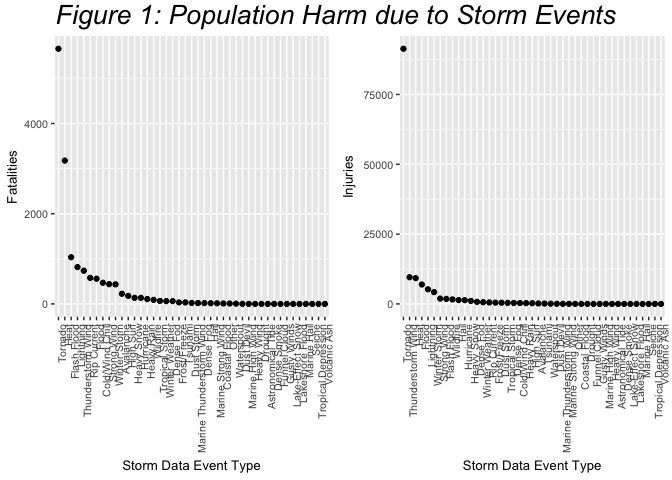
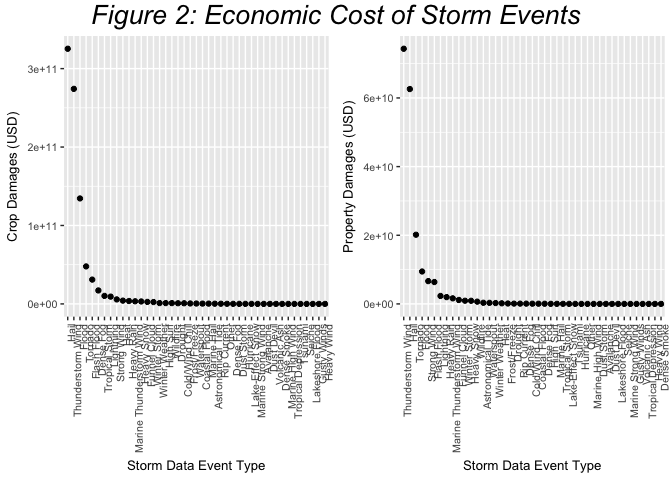

## Reproducible Research week 4 peer review project 

The following chunk of code downloads the data directly from the hosted location, unzips the data as a csv and converts to a data table format to be more rapidly manipulated.


```r
library(data.table)
```

```
## Warning: package 'data.table' was built under R version 3.3.2
```

```r
temp <- tempfile()
download.file("https://d396qusza40orc.cloudfront.net/repdata%2Fdata%2FStormData.csv.bz2",temp,cacheOK = TRUE)
df<-read.csv(temp)

df<-data.table(df)
```
Looking at the data it is evident that there is a lot more than the 48 event names found in the NWSI 10-1065 sheet.  In order to ensure that as much of this data is included in the analysis as possible, and to correctly assign the events to best estimate the impact of a given event, each event type was revalued to one of the NWSI event types.  When the event could not be determined from the given event type in the data it was classified as "other."  This next large chunk of code is present to document how the revaluation of the event types were performed.  


```r
library(plyr)
library(dplyr)
```

```
## -------------------------------------------------------------------------
```

```
## data.table + dplyr code now lives in dtplyr.
## Please library(dtplyr)!
```

```
## -------------------------------------------------------------------------
```

```
## 
## Attaching package: 'dplyr'
```

```
## The following objects are masked from 'package:plyr':
## 
##     arrange, count, desc, failwith, id, mutate, rename, summarise,
##     summarize
```

```
## The following objects are masked from 'package:data.table':
## 
##     between, first, last
```

```
## The following objects are masked from 'package:stats':
## 
##     filter, lag
```

```
## The following objects are masked from 'package:base':
## 
##     intersect, setdiff, setequal, union
```

```r
#Recategorizing event types to properly quantify the impacts of diffferent weather types.  The categories were individually forced into one of the categories from 2.1.1 Storm Data Event Table found in the NWSI 10-1605 document.

df$EventName <- revalue(df$EVTYPE,
               c("   HIGH SURF ADVISORY"="High Surf",
                 " COASTAL FLOOD"="Coastal Flood",
                 " FLASH FLOOD"="Flash Flood",
                 " LIGHTNING"="Lightning",
                 " TSTM WIND"="Thunderstorm Wind",
                 " TSTM WIND (G45)"="Thunderstorm Wind",
                 " WATERSPOUT"="Waterspout",
                 " TSTM WIND"="Thunderstorm Wind",
                 " WIND"="Heavy Wind",
                 "?"="Other",
                 "ABNORMAL WARMTH"="Heat",
                 "ABNORMALLY DRY"="Drought",
                 "ABNORMALLY WET"="Other",
                 "ACCUMULATED SNOWFALL"="Heavy Snow",
                 "AGRICULTURAL FREEZE"="Frost/Freeze",
                 "APACHE COUNTY"="Other",
                 "ASTRONOMICAL HIGH TIDE"="Astronomical Tide",
                 "ASTRONOMICAL LOW TIDE"="Astronomical Tide",
                 "AVALANCE"="Avalanche",
                 "AVALANCHE"="Avalanche",
                 "BEACH EROSIN"="Coastal Flood",
                 "Beach Erosion"="Coastal Flood",
                 "BEACH EROSION"="Coastal Flood",
                 "BEACH EROSION/COASTAL FLOOD"="Coastal Flood",
                 "BEACH FLOOD"="Coastal Flood",
                 "BELOW NORMAL PRECIPITATION"="Drought",
                 "BITTER WIND CHILL"="Cold/Wind Chill",
                 "BITTER WIND CHILL TEMPERATURES"="Cold/Wind Chill",
                 "Black Ice"="Frost/Freeze",
                 "BLACK ICE"="Frost/Freeze",
                 "BLIZZARD"="Winter Storm",
                 "BLIZZARD/HIGH WIND"="Winter Storm",
                 "BLIZZARD AND EXTREME WIND CHIL"="Winter Storm",
                 "BLIZZARD AND HEAVY SNOW"="Winter Storm",
                 "BLIZZARD/HEAVY SNOW"="Winter Storm",
                 "Blizzard Summary"="Winter Storm",
                 "BLIZZARD WEATHER"="Winter Weather",
                 "BLIZZARD/FREEZING RAIN"="Winter Storm",
                 "BLIZZARD/WINTER STORM"="Winter Storm",
                 "BLOW-OUT TIDE"="Astronomical Tide",
                 "BLOW-OUT TIDES"="Astronomical Tide",
                 "BLOWING DUST"="Dust Storm",
                 "blowing snow"="Winter Storm",
                 "Blowing Snow"="Winter Storm",
                 "BLOWING SNOW"="Winter Storm",
                 "BLOWING SNOW & EXTREME WIND CH"="Winter Storm",
                 "BLOWING SNOW- EXTREME WIND CHI"="Winter Storm",
                 "BLOWING SNOW/EXTREME WIND CHIL"="Winter Storm",
                 "BREAKUP FLOODING"="Flood",
                 "BRUSH FIRE"="Wildfire",
                 "BRUSH FIRES"="Wildfire",
                 "COASTAL  FLOODING/EROSION"="Coastal Flood",
                 "COASTAL EROSION"="Coastal Flood",
                 "Coastal Flood"="Coastal Flood",
                 "COASTAL FLOOD"="Coastal Flood",
                 "coastal flooding"="Coastal Flood",
                 "Coastal Flooding"="Coastal Flood",
                 "COASTAL FLOODING"="Coastal Flood",
                 "COASTAL FLOODING/EROSION"="Coastal Flood",
                 "Coastal Storm"="Coastal Flood",
                 "COASTAL STORM"="Coastal Flood",
                 "COASTAL SURGE"="Coastal Flood",
                 "COASTAL/TIDAL FLOOD"="Coastal Flood",
                 "COASTALFLOOD"="Coastal Flood",
                 "COASTALSTORM"="Coastal Flood",
                 "Cold"="Cold/Wind Chill",
                 "COLD"="Cold/Wind Chill",
                 "COLD AIR FUNNEL"="Strong Wind",
                 "COLD AIR FUNNELS"="Strong Wind",
                 "COLD AIR TORNADO"="Strong Wind",
                 "Cold and Frost"="Frost/Freeze",
                 "COLD AND FROST"="Frost/Freeze",
                 "COLD AND SNOW"="Winter Storm",
                 "COLD AND WET CONDITIONS"="Cold/Wind Chill",
                 "Cold Temperature"="Cold/Wind Chill",
                 "COLD TEMPERATURES"="Cold/Wind Chill",
                 "COLD WAVE"="Cold/Wind Chill",
                 "COLD WEATHER"="Cold/Wind Chill",
                 "COLD WIND CHILL TEMPERATURES"="Cold/Wind Chill",
                 "COLD/WIND CHILL"="Cold/Wind Chill",
                 "COLD/WINDS"="Cold/Wind Chill",
                 "COOL AND WET"="Cold/Wind Chill",
                 "COOL SPELL"="Cold/Wind Chill",
                 "CSTL FLOODING/EROSION"="Coastal Flood",
                 "DAM BREAK"="Flood",
                 "DAM FAILURE"="Flood",
                 "Damaging Freeze"="Frost/Freeze",
                 "DAMAGING FREEZE"="Frost/Freeze",
                 "DEEP HAIL"="Hail",
                 "DENSE FOG"="Dense Fog",
                 "DENSE SMOKE"="Dense Smoke",
                 "DOWNBURST"="Thunderstorm Wind",
                 "DOWNBURST WINDS"="Thunderstorm Wind",
                 "DRIEST MONTH"="Drought",
                 "Drifting Snow"="Winter Storm",
                 "DROUGHT"="Drought",
                 "DROUGHT/EXCESSIVE HEAT"="Heat",
                 "DROWNING"="Other",
                 "DRY"="Drought",
                 "DRY CONDITIONS"="Drought",
                 "DRY HOT WEATHER"="Drought",
                 "DRY MICROBURST"="Strong Wind",
                 "DRY MICROBURST 50"="Strong Wind",
                 "DRY MICROBURST 53"="Strong Wind",
                 "DRY MICROBURST 58"="Strong Wind",
                 "DRY MICROBURST 61"="Strong Wind",
                 "DRY MICROBURST 84"="Strong Wind",
                 "DRY MICROBURST WINDS"="Strong Wind",
                 "DRY MIRCOBURST WINDS"="Strong Wind",
                 "DRY PATTERN"="Drought",
                 "DRY SPELL"="Drought",
                 "DRY WEATHER"="Drought",
                 "DRYNESS"="Drought",
                 "DUST DEVEL"="Dust Devil",
                 "Dust Devil"="Dust Devil",
                 "DUST DEVIL"="Dust Devil",
                 "DUST DEVIL WATERSPOUT"="Dust Devil",
                 "DUST STORM"="Dust Storm",
                 "DUST STORM/HIGH WINDS"="Dust Storm",
                 "DUSTSTORM"="Dust Storm",
                 "EARLY FREEZE"="Frost/Freeze",
                 "Early Frost"="Frost/Freeze",
                 "EARLY FROST"="Frost/Freeze",
                 "EARLY RAIN"="Other",
                 "EARLY SNOW"="Winter Storm",
                 "Early snowfall"="Winter Storm",
                 "EARLY SNOWFALL"="Winter Storm",
                 "Erosion/Cstl Flood"="Coastal Flood",
                 "EXCESSIVE"="Other",
                 "Excessive Cold"="Cold/Wind Chill",
                 "EXCESSIVE HEAT"="Heat",
                 "EXCESSIVE HEAT/DROUGHT"="Heat",
                 "EXCESSIVE PRECIPITATION"="Flood",
                 "EXCESSIVE RAIN"="Flood",
                 "EXCESSIVE RAINFALL"="Flood",
                 "EXCESSIVE SNOW"="Winter Storm",
                 "EXCESSIVE WETNESS"="Flood",
                 "EXCESSIVELY DRY"="Drought",
                 "Extended Cold"="Cold/Wind Chill",
                 "Extreme Cold"="Cold/Wind Chill",
                 "EXTREME COLD"="Cold/Wind Chill",
                 "EXTREME COLD/WIND CHILL"="Cold/Wind Chill",
                 "EXTREME HEAT"="Heat",
                 "EXTREME WIND CHILL"="Cold/Wind Chill",
                 "EXTREME WIND CHILL/BLOWING SNO"="Winter Storm",
                 "EXTREME WIND CHILLS"="Cold/Wind Chill",
                 "EXTREME WINDCHILL"="Cold/Wind Chill",
                 "EXTREME WINDCHILL TEMPERATURES"="Cold/Wind Chill",
                 "EXTREME/RECORD COLD"="Cold/Wind Chill",
                 "EXTREMELY WET"="Flood",
                 "FALLING SNOW/ICE"="Winter Storm",
                 "FIRST FROST"="Frost/Freeze",
                 "FIRST SNOW"="Winter Storm",
                 "FLASH FLOOD"="Flash Flood",
                 "FLASH FLOOD - HEAVY RAIN"="Flash Flood",
                 "FLASH FLOOD FROM ICE JAMS"="Flash Flood",
                 "FLASH FLOOD LANDSLIDES"="Flash Flood",
                 "FLASH FLOOD WINDS"="Flash Flood",
                 "FLASH FLOOD/"="Flash Flood",
                 "FLASH FLOOD/ FLOOD"="Flash Flood",
                 "FLASH FLOOD/ STREET"="Flash Flood",
                 "FLASH FLOOD/FLOOD"="Flash Flood",
                 "FLASH FLOOD/HEAVY RAIN"="Flash Flood",
                 "FLASH FLOOD/LANDSLIDE"="Flash Flood",
                 "FLASH FLOODING"="Flash Flood",
                 "FLASH FLOODING/FLOOD"="Flash Flood",
                 "FLASH FLOODING/THUNDERSTORM WI"="Flash Flood",
                 "FLASH FLOODS"="Flash Flood",
                 "FLASH FLOOODING"="Flash Flood",
                 "Flood"="Flood",
                 "FLOOD"="Flood",
                 "FLOOD & HEAVY RAIN"="Flood",
                 "FLOOD FLASH"="Flash Flood",
                 "FLOOD FLOOD/FLASH"="Flash Flood",
                 "FLOOD WATCH/"="Flood",
                 "FLOOD/FLASH"="Flash Flood",
                 "Flood/Flash Flood"="Flash Flood",
                 "FLOOD/FLASH FLOOD"="Flash Flood",
                 "FLOOD/FLASH FLOODING"="Flash Flood",
                 "FLOOD/FLASH/FLOOD"="Flash Flood",
                 "FLOOD/FLASHFLOOD"="Flash Flood",
                 "FLOOD/RAIN/WIND"="Flood",
                 "FLOOD/RAIN/WINDS"="Flood",
                 "FLOOD/RIVER FLOOD"="Flood",
                 "Flood/Strong Wind"="Flood",
                 "FLOODING"="Flood",
                 "FLOODING/HEAVY RAIN"="Flood",
                 "FLOODS"="Flood",
                 "FOG"="Dense Fod",
                 "FOG AND COLD TEMPERATURES"="Cold/Wind Chill",
                 "FOREST FIRES"="Wildfire",
                 "Freeze"="Frost/Freeze",
                 "FREEZE"="Frost/Freeze",
                 "Freezing drizzle"="Winter Storm",
                 "Freezing Drizzle"="Frost/Freeze",
                 "FREEZING DRIZZLE"="Frost/Freeze",
                 "FREEZING DRIZZLE AND FREEZING"="Frost/Freeze",
                 "Freezing Fog"="Frost/Freeze",
                 "FREEZING FOG"="Frost/Freeze",
                 "FREEZING DRIZZLE AND FREEZING"="Frost/Freeze",
                 "Freezing Fog"="Frost/Freeze",
                 "FREEZING FOG"="Frost/Freeze",
                 "Freezing rain"="Frost/Freeze",
                 "Freezing Rain"="Frost/Freeze",
                 "FREEZING RAIN"="Frost/Freeze",
                 "FREEZING RAIN AND SLEET"="Frost/Freeze",
                 "FREEZING RAIN AND SNOW"="Frost/Freeze",
                 "FREEZING RAIN SLEET AND"="Frost/Freeze",
                 "FREEZING RAIN SLEET AND LIGHT"="Frost/Freeze",
                 "FREEZING RAIN/SLEET"="Frost/Freeze",
                 "FREEZING RAIN/SNOW"="Frost/Freeze",
                 "Freezing Spray"="Frost/Freeze",
                 "Frost"="Frost/Freeze",
                 "FROST"="Frost/Freeze",
                 "Frost/Freeze"="Frost/Freeze",
                 "FROST/FREEZE"="Frost/Freeze",
                 "FROST\\FREEZE"="Frost/Freeze",
                 "FUNNEL"="Funnel Cloud",
                 "Funnel Cloud"="Funnel Cloud",
                 "FUNNEL CLOUD"="Funnel Cloud",
                 "FUNNEL CLOUDS"="Funnel Cloud",
                 "FUNNEL CLOUD."="Funnel Cloud",
                 "FUNNEL CLOUD/HAIL"="Funnel Cloud",
                 "FUNNELS"="Funnel Cloud",
                 "Glaze"="Frost/Freeze",
                 "GLAZE"="Frost/Freeze",
                 "GLAZE ICE"="Frost/Freeze",
                 "GLAZE/ICE STORM"="Frost/Freeze",
                 "GLAZE"="Frost/Freeze",
                 "GLAZE ICE"="Frost/Freeze",
                 "GLAZE/ICE STORM"="Frost/Freeze",
                 "gradient wind"="Strong Wind",
                 "Gradient wind"="Strong Wind",
                 "GRADIENT WIND"="Strong Wind",
                 "GRADIENT WINDS"="Strong Wind",
                 "GRASS FIRES"="Wildfire",
                 "GROUND BLIZZARD"="Winter Storm",
                 "GUSTNADO"="Strong Wind",
                 "GUSTNADO AND"="Strong Wind",
                 "GUSTY LAKE WIND"="Strong Wind",
                 "GUSTY THUNDERSTORM WIND"="Thunderstorm Wind",
                 "GUSTY THUNDERSTORM WINDS"="Thunderstorm Wind",
                 "Gusty Wind"="Strong Wind",
                 "GUSTY WIND"="Strong Wind",
                 "GUSTY WINDS"="Strong Wind",
                 "GUSTY WIND/HAIL"="Hail",
                 "GUSTY WIND/HVY RAIN"="Strong Wind",
                 "Gusty wind/rain"="Strong Wind",
                 "Gusty winds"="Strong Wind",
                 "HAIL"="Hail",
                 "HAIL 0.75"="Hail",
                 "HAIL 0.88"="Hail",
                 "HAIL 075"="Hail",
                 "HAIL 088"="Hail",
                 "HAIL 1.00"="Hail",
                 "HAIL 1.75"="Hail",
                 "HAIL 1.75)"="Hail",
                 "HAIL 100"="Hail",
                 "HAIL 125"="Hail",
                 "HAIL 150"="Hail",
                 "HAIL 175"="Hail",
                 "HAIL 200"="Hail",
                 "HAIL 225"="Hail",
                 "HAIL 275"="Hail",
                 "HAIL 450"="Hail",
                 "HAIL 75"="Hail",
                 "HAIL 80"="Hail",
                 "HAIL 88"="Hail",
                 "HAIL ALOFT"="Hail",
                 "HAIL DAMAGE"="Hail",
                 "HAIL FLOODING"="Hail",
                 "HAIL STORM"="Hail",
                 "Hail(0.75)"="Hail",
                 "HAIL/ICY ROADS"="Hail",
                 "HAIL/WIND"="Hail",
                 "HAIL/WINDS"="Hail",
                 "HAILSTORM"="Hail",
                 "HAILSTORMS"="Hail",
                 "HARD FREEZE"="Frost/Freeze",
                 "HAZARDOUS SURF"="High Surf",
                 "HEAT"="Heat",
                 "HEAT DROUGHT"="Heat",
                 "Heat Wave"="Heat",
                 "HEAT WAVE"="Heat",
                 "HEAT WAVE DROUGHT"="Heat",
                 "HEAT WAVES"="Heat",
                 "HEAT/DROUGHT"="Heat",
                 "Heatburst"="Heat",
                 "HEAVY LAKE SNOW"="Heavy Snow",
                 "HEAVY MIX"="Heavy Snow",
                 "HEAVY PRECIPATATION"="Heavy Rain",
                 "Heavy Precipitation"="Heavy Rain",
                 "HEAVY PRECIPITATION"="Heavy Rain",
                 "Heavy rain"="Heavy Rain",
                 "Heavy Rain"="Heavy Rain",
                 "HEAVY RAIN"="Heavy Rain",
                 "HEAVY RAIN AND FLOOD"="Heavy Rain",
                 "Heavy Rain and Wind"="Heavy Rain",
                 "HEAVY RAIN EFFECTS"="Heavy Rain",
                 "HEAVY RAIN; URBAN FLOOD WINDS;"="Heavy Rain",
                 "HEAVY RAIN/FLOODING"="Heavy Rain",
                 "Heavy Rain/High Surf"="Heavy Rain",
                 "HEAVY RAIN/LIGHTNING"="Heavy Rain",
                 "HEAVY RAIN/MUDSLIDES/FLOOD"="Heavy Rain",
                 "HEAVY RAIN/SEVERE WEATHER"="Heavy Rain",
                 "HEAVY RAIN/SMALL STREAM URBAN"="Heavy Rain",
                 "HEAVY RAIN/SNOW"="Heavy Rain",
                 "HEAVY RAIN/URBAN FLOOD"="Heavy Rain",
                 "HEAVY RAIN/WIND"="Heavy Rain",
                 "HEAVY RAINFALL"="Heavy Rain",
                 "HEAVY RAINS"="Heavy Rain",
                 "HEAVY RAINS/FLOODING"="Heavy Rain",
                 "HEAVY SEAS"="Heavy Rain",
                 "HEAVY SHOWER"="Heavy Rain",
                 "HEAVY SHOWERS"="Heavy Rain",
                 "HEAVY SNOW"="Heavy Snow",
                 "HEAVY SNOW   FREEZING RAIN"="Heavy Snow",
                 "HEAVY SNOW & ICE"="Heavy Snow",
                 "HEAVY SNOW AND"="Heavy Snow",
                 "HEAVY SNOW AND HIGH WINDS"="Heavy Snow",
                 "HEAVY SNOW AND ICE"="Heavy Snow",
                 "HEAVY SNOW AND ICE STORM"="Heavy Snow",
                 "HEAVY SNOW AND STRONG WINDS"="Heavy Snow",
                 "HEAVY SNOW ANDBLOWING SNOW"="Heavy Snow",
                 "Heavy snow shower"="Heavy Snow",
                 "HEAVY SNOW SQUALLS"="Heavy Snow",
                 "HEAVY SNOW-SQUALLS"="Heavy Snow",
                 "HEAVY SNOW/BLIZZARD"="Heavy Snow",
                 "HEAVY SNOW/BLIZZARD/AVALANCHE"="Heavy Snow",
                 "HEAVY SNOW/BLOWING SNOW"="Heavy Snow",
                 "HEAVY SNOW/FREEZING RAIN"="Heavy Snow",
                 "HEAVY SNOW/HIGH"="Heavy Snow",
                 "HEAVY SNOW/HIGH WIND"="Heavy Snow",
                 "HEAVY SNOW/HIGH WINDS"="Heavy Snow",
                 "HEAVY SNOW/HIGH WINDS & FLOOD"="Heavy Snow",
                 "HEAVY SNOW/HIGH WINDS/FREEZING"="Heavy Snow",
                 "HEAVY SNOW/ICE"="Heavy Snow",
                 "HEAVY SNOW/ICE STORM"="Heavy Snow",
                 "HEAVY SNOW/SLEET"="Heavy Snow",
                 "HEAVY SNOW/SQUALLS"="Heavy Snow",
                 "HEAVY SNOW/WINTER STORM"="Heavy Snow",
                 "HEAVY SNOW/WIND"="Heavy Snow",
                 "HEAVY SNOWPACK"="Heavy Snow",
                 "Heavy Surf"="High Surf",
                 "HEAVY SURF"="High Surf",
                 "Heavy surf and wind"="High Surf",
                 "HEAVY SURF COASTAL FLOODING"="Coastal Flood",
                 "HEAVY SURF/HIGH SURF"="High Surf",
                 "HEAVY SWELLS"="High Surf",
                 "HEAVY WET SNOW"="Heavy Snow",
                 "HIGH"="Other",
                 "HIGH  SWELLS"="High Surf",
                 "Heavy Wind"="Strong Wind",
                 "HIGH  WINDSW"="Strong Wind",
                 "HIGH SEAS"="High Surf",
                 "High Surf"="High Surf",
                 "HIGH SURF"="High Surf",
                 "HIGH SURF ADVISORIES"="High Surf",
                 "HIGH SURF ADVISORY"="High Surf",
                 "HIGH SWELLS"="High Surf",
                 "HIGH TEMPERATURE RECORD"="Heat",
                 "HIGH TIDES"="High Surf",
                 "HIGH WATER"="High Surf",
                 "HIGH WAVES"="High Surf",
                 "High Wind"="Strong Wind",
                 "HIGH WIND"="Strong Wind",
                 "HIGH WIND (G40)"="Strong Wind",
                 "HIGH WIND 48"="Strong Wind",
                 "HIGH WIND 63"="Strong Wind",
                 "HIGH WIND 70"="Strong Wind",
                 "HIGH WIND AND HEAVY SNOW"="Strong Wind",
                 "HIGH WIND AND HIGH TIDES"="Strong Wind",
                 "HIGH WIND AND SEAS"="Strong Wind",
                 "HIGH WIND DAMAGE"="Strong Wind",
                 "HIGH WIND/ BLIZZARD"="Strong Wind",
                 "HIGH WIND/BLIZZARD"="Strong Wind",
                 "HIGH WIND/BLIZZARD/FREEZING RA"="Strong Wind",
                 "HIGH WIND/HEAVY SNOW"="Strong Wind",
                 "HIGH WIND/LOW WIND CHILL"="Strong Wind",
                 "HIGH WIND/SEAS"="Strong Wind",
                 "HIGH WIND/WIND CHILL"="Strong Wind",
                 "HIGH WIND/WIND CHILL/BLIZZARD"="Strong Wind",
                 "HIGH WINDS"="Strong Wind",
                 "HIGH  WINDS"="Strong Wind",
                 "HIGH WINDS 55"="Strong Wind",
                 "HIGH WINDS 57"="Strong Wind",
                 "HIGH WINDS 58"="Strong Wind",
                 "HIGH WINDS 63"="Strong Wind",
                 "HIGH WINDS 66"="Strong Wind",
                 "HIGH WINDS 67"="Strong Wind",
                 "HIGH WINDS 73"="Strong Wind",
                 "HIGH WINDS 76"="Strong Wind",
                 "HIGH WINDS 80"="Strong Wind",
                 "HIGH WINDS 82"="Strong Wind",
                 "HIGH WINDS AND WIND CHILL"="Strong Wind",
                 "HIGH WINDS DUST STORM"="Strong Wind",
                 "HIGH WINDS HEAVY RAINS"="Strong Wind",
                 "HIGH WINDS/"="Strong Wind",
                 "HIGH WINDS/COASTAL FLOOD"="Strong Wind",
                 "HIGH WINDS/COLD"="Strong Wind",
                 "HIGH WINDS/FLOODING"="Strong Wind",
                 "HIGH WINDS/HEAVY RAIN"="Strong Wind",
                 "HIGH WINDS/SNOW"="Strong Wind",
                 "HIGHWAY FLOODING"="Flood",
                 "Hot and Dry"="Heat",
                 "HOT PATTERN"="Heat",
                 "HOT SPELL"="Heat",
                 "HOT WEATHER"="Heat",
                 "HOT/DRY PATTERN"="Heat",
                 "HURRICANE"="Hurricane",
                 "Hurricane Edouard"="Hurricane",
                 "HURRICANE EMILY"="Hurricane",
                 "HURRICANE ERIN"="Hurricane",
                 "HURRICANE FELIX"="Hurricane",
                 "HURRICANE GORDON"="Hurricane",
                 "HURRICANE OPAL"="Hurricane",
                 "HURRICANE OPAL/HIGH WINDS"="Hurricane",
                 "HURRICANE-GENERATED SWELLS"="Hurricane",
                 "HURRICANE/TYPHOON"="Hurricane",
                 "HVY RAIN"="Heavy Rain",
                 "HYPERTHERMIA/EXPOSURE"="Cold/Wind Chill",
                 "HYPOTHERMIA"="Cold/Wind Chill",
                 "Hypothermia/Exposure"="Cold/Wind Chill",
                 "HYPOTHERMIA/EXPOSURE"="Cold/Wind Chill",
                 "ICE"="Frost/Freeze",
                 "ICE AND SNOW"="Frost/Freeze",
                 "ICE FLOES"="Frost/Freeze",
                 "Ice Fog"="Frost/Freeze",
                 "ICE JAM"="Frost/Freeze",
                 "Ice jam flood (minor"="Frost/Freeze",
                 "ICE JAM FLOODING"="Frost/Freeze",
                 "ICE ON ROAD"="Frost/Freeze",
                 "ICE PELLETS"="Frost/Freeze",
                 "ICE ROADS"="Frost/Freeze",
                 "ICE STORM"="Winter Storm",
                 "ICE STORM AND SNOW"="Winter Storm",
                 "ICE STORM/FLASH FLOOD"="Winter Storm",
                 "Ice/Snow"="Winter Storm",
                 "ICE/SNOW"="Winter Storm",
                 "ICE/STRONG WINDS"="Winter Storm",
                 "Icestorm/Blizzard"="Winter Storm",
                 "Icy Roads"="Frost/Freeze",
                 "ICY ROADS"="Frost/Freeze",
                 "LACK OF SNOW"="Other",
                 "Lake Effect Snow"="Lake-Effect Snow",
                 "Lake Effect Sno"="Lake-Effect Snow",
                 "LAKE EFFECT SNOW"="Lake-Effect Snow",
                 "LAKE FLOOD"="Flood",
                 "LAKE-EFFECT SNOW"="Lake-Effect Snow",
                 "LAKESHORE FLOOD"="Lakeshore Flood",
                 "LANDSLIDE"="Flood",
                 "LANDSLIDE/URBAN FLOOD"="Flood",
                 "LANDSLIDES"="Flood",
                 "Landslump"="Flood",
                 "LANDSLUMP"="Flood",
                 "LANDSPOUT"="Flood",
                 "LARGE WALL CLOUD"="Strong Wind",
                 "LATE FREEZE"="Frost/Freeze",
                 "LATE SEASON HAIL"="Hail",
                 "LATE SEASON SNOW"="Heavy Snow",
                 "Late Season Snowfall"="Heavy Snow",
                 "LATE SNOW"="Heavy Snow",
                 "LATE SEASON SNOW"="Heavy Snow",
                 "Late Season Snowfall"="Heavy Snow",
                 "LATE SNOW"="Heavy Snow",
                 "Late-season Snowfall"="Heavy Snow",
                 "LIGHT FREEZING RAIN"="Frost/Freeze",
                 "Light snow"="Heavy Snow",
                 "Late-season Snowfall"="Heavy Snow",
                 "LIGHT FREEZING RAIN"="Frost/Freeze",
                 "Light snow"="Heavy Snow",
                 "Light Snow"="Heavy Snow",
                 "LIGHT SNOW"="Heavy Snow",
                 "LIGHT SNOW AND SLEET"="Heavy Snow",
                 "Light Snow/Flurries"="Heavy Snow",
                 "LIGHT SNOW/FREEZING PRECIP"="Heavy Snow",
                 "Light Snowfall"="Heavy Snow",
                 "LIGHTING"="Lightning",
                 "LIGHTNING"="Lightning",
                 "LIGHTNING  WAUSEON"="Lightning",
                 "LIGHTNING AND HEAVY RAIN"="Lightning",
                 "LIGHTNING AND THUNDERSTORM WIN"="Lightning",
                 "LIGHTNING AND WINDS"="Lightning",
                 "LIGHTNING DAMAGE"="Lightning",
                 "LIGHTNING FIRE"="Lightning",
                 "LIGHTNING INJURY"="Lightning",
                 "LIGHTNING THUNDERSTORM WINDS"="Lightning",
                 "LIGHTNING THUNDERSTORM WINDSS"="Lightning",
                 "LIGHTNING."="Lightning",
                 "LIGHTNING/HEAVY RAIN"="Lightning",
                 "LIGNTNING"="Lightning",
                 "LOCAL FLASH FLOOD"="Flash Flood",
                 "LOCAL FLOOD"="Flood",
                 "LOCALLY HEAVY RAIN"="Heavy Rain",
                 "LOW TEMPERATURE"="Cold/Wind Chill",
                 "LOW TEMPERATURE RECORD"="Cold/Wind Chill",
                 "LOW WIND CHILL"="Cold/Wind Chill",
                 "MAJOR FLOOD"="Flood",
                 "Marine Accident"="Other",
                 "MARINE HAIL"="Marine Hail",
                 "MARINE HIGH WIND"="Marine High Wind",
                 "MARINE MISHAP"="Other",
                 "MARINE STRONG WIND"="Marine Strong Wind",
                 "MARINE THUNDERSTORM WIND"="Marine Thunderstorm Wind",
                 "MARINE TSTM WIND"="Marine Thunderstorm Wind",
                 "Metro Storm, May 26"="Heavy Rain",
                 "Microburst"="Strong Wind",
                 "MICROBURST"="Strong Wind",
                 "MICROBURST WINDS"="Strong Wind",
                 "Mild and Dry Pattern"="Drought",
                 "MILD PATTERN"="Drought",
                 "MILD/DRY PATTERN"="Drought",
                 "MINOR FLOOD"="Flood",
                 "Minor Flooding"="Flood",
                 "MINOR FLOODING"="Flood",
                 "MIXED PRECIP"="Heavy Rain",
                 "Mixed Precipitation"="Heavy Rain",
                 "MIXED PRECIPITATION"="Heavy Rain",
                 "MODERATE SNOW"="Heavy Snow",
                 "MODERATE SNOWFALL"="Heavy Snow",
                 "MONTHLY PRECIPITATION"="Heavy Rain",
                 "Monthly Rainfall"="Heavy Rain",
                 "MONTHLY RAINFALL"="Heavy Rain",
                 "Monthly Snowfall"="Heavy Snow",
                 "MONTHLY SNOWFALL"="Heavy Snow",
                 "MONTHLY TEMPERATURE"="Other",
                 "Mountain Snows"="Heavy Snow",
                 "MUD SLIDE"="Flood",
                 "MUD SLIDES"="Flood",
                 "MUD SLIDES URBAN FLOODING"="Flood",
                 "MUD/ROCK SLIDE"="Flood",
                 "Mudslide"="Flood",
                 "MUDSLIDE"="Flood",
                 "MUDSLIDE/LANDSLIDE"="Flood",
                 "Mudslides"="Flood",
                 "MUDSLIDES"="Flood",
                 "NEAR RECORD SNOW"="Heavy Snow",
                 "No Severe Weather"="Other",
                 "NON SEVERE HAIL"="Hail",
                 "NON TSTM WIND"="Strong Wind",
                 "NON-SEVERE WIND DAMAGE"="Strong Wind",
                 "NON-TSTM WIND"="Strong Wind",
                 "NONE"="Other",
                 "NORMAL PRECIPITATION"="Heavy Rain",
                 "NORTHERN LIGHTS"="Other",
                 "Other"="Other",
                 "OTHER"="Other",
                 "PATCHY DENSE FOG"="Dense Fog",
                 "PATCHY ICE"="Frost/Freeze",
                 "Prolong Cold"="Cold/Wind Chill",
                 "PROLONG COLD"="Cold/Wind Chill",
                 "PROLONG COLD/SNOW"="Cold/Wind Chill",
                 "PROLONG WARMTH"="Heat",
                 "PROLONGED RAIN"="Heavy Rain",
                 "RAIN"="Heavy Rain",
                 "RAIN (HEAVY)"="Heavy Rain",
                 "RAIN AND WIND"="Heavy Rain",
                 "Rain Damage"="Heavy Rain",
                 "RAIN/SNOW"="Heavy Rain",
                 "RAIN/WIND"="Heavy Rain",
                 "RAINSTORM"="Heavy Rain",
                 "RAPIDLY RISING WATER"="Flood",
                 "RECORD  COLD"="Cold/Wind Chill",
                 "Record Cold"="Cold/Wind Chill",
                 "RECORD COLD"="Cold/Wind Chill",
                 "RECORD COLD AND HIGH WIND"="Cold/Wind Chill",
                 "RECORD COLD/FROST"="Cold/Wind Chill",
                 "RECORD COOL"="Cold/Wind Chill",
                 "Record dry month"="Drought",
                 "RECORD DRYNESS"="Drought",
                 "Record Heat"="Heat",
                 "RECORD HEAT"="Heat",
                 "RECORD HEAT WAVE"="Heat",
                 "Record High"="Heat",
                 "RECORD HIGH"="Heat",
                 "RECORD HIGH TEMPERATURE"="Heat",
                 "RECORD HIGH TEMPERATURES"="Heat",
                 "RECORD LOW"="Cold/Wind Chill",
                 "RECORD LOW RAINFALL"="Drought",
                 "Record May Snow"="Heavy Snow",
                 "RECORD PRECIPITATION"="Heavy Rain",
                 "RECORD RAINFALL"="Heavy Rain",
                 "RECORD SNOW"="Heavy Snow",
                 "RECORD SNOW/COLD"="Heavy Snow",
                 "RECORD SNOWFALL"="Heavy Snow",
                 "Record temperature"="Other",
                 "RECORD TEMPERATURE"="Other",
                 "Record Temperatures"="Other",
                 "RECORD TEMPERATURES"="Other",
                 "RECORD WARM"="Heat",
                 "RECORD WARM TEMPS."="Heat",
                 "Record Warmth"="Heat",
                 "RECORD WARMTH"="Heat",
                 "Record Winter Snow"="Heavy Snow",
                 "RECORD/EXCESSIVE HEAT"="Heat",
                 "RECORD/EXCESSIVE RAINFALL"="Heavy Rain",
                 "RED FLAG CRITERIA"="Other",
                 "RED FLAG FIRE WX"="Wildfire",
                 "REMNANTS OF FLOYD"="Hurricane",
                 "RIP CURRENT"="Rip Current",
                 "RIP CURRENTS"="Rip Current",
                 "RIP CURRENTS HEAVY SURF"="Rip Current",
                 "RIP CURRENTS/HEAVY SURF"="Rip Current",
                 "RIVER AND STREAM FLOOD"="Flood",
                 "RIVER FLOOD"="Flood",
                 "River Flooding"="Flood",
                 "RIVER AND STREAM FLOOD"="Flood",
                 "RIVER FLOOD"="Flood",
                 "River Flooding"="Flood",
                 "RIVER FLOODING"="Flood",
                 "ROCK SLIDE"="Other",
                 "ROGUE WAVE"="Tsunami",
                 "ROTATING WALL CLOUD"="Strong Wind",
                 "ROCK SLIDE"="Other",
                 "ROGUE WAVE"="Tsunami",
                 "ROTATING WALL CLOUD"="Strong Wind",
                 "ROUGH SEAS"="High Surf",
                 "ROUGH SURF"="High Surf",
                 "RURAL FLOOD"="Flood",
                 "Saharan Dust"="Dust Storm",
                 "SAHARAN DUST"="Dust Storm",
                 "Seasonal Snowfall"="Heavy Snow",
                 "SEICHE"="Seiche",
                 "SEVERE COLD"="Cold/Wind Chill",
                 "SEVERE THUNDERSTORM"="Thunderstorm Wind",
                 "SEVERE THUNDERSTORM WINDS"="Thunderstorm Wind",
                 "SEVERE THUNDERSTORMS"="Thunderstorm Wind",
                 "SEVERE TURBULENCE"="Thunderstorm Wind",
                 "SEVERE THUNDERSTORM WINDS"="Thunderstorm Wind",
                 "SEVERE THUNDERSTORMS"="Thunderstorm Wind",
                 "SEVERE TURBULENCE"="Thunderstorm Wind",
                 "SLEET"="Winter Storm",
                 "SLEET & FREEZING RAIN"="Winter Storm",
                 "SLEET STORM"="Winter Storm",
                 "SLEET/FREEZING RAIN"="Winter Storm",
                 "SLEET/ICE STORM"="Winter Storm",
                 "SLEET/RAIN/SNOW"="Winter Storm",
                 "SLEET/SNOW"="Winter Storm",
                 "small hail"="Hail",
                 "Small Hail"="Hail",
                 "SMALL HAIL"="Hail",
                 "SMALL STREAM"="Flood",
                 "SMALL STREAM AND"="Flood",
                 "SMALL STREAM AND URBAN FLOOD"="Flood",
                 "SMALL STREAM AND URBAN FLOODIN"="Flood",
                 "SMALL STREAM FLOOD"="Flood",
                 "SMALL STREAM FLOODING"="Flood",
                 "SMALL STREAM URBAN FLOOD"="Flood",
                 "SMALL STREAM/URBAN FLOOD"="Flood",
                 "Sml Stream Fld"="Flood",
                 "SMOKE"="Dense Smoke",
                 "Snow"="Heavy Snow",
                 "SNOW"="Heavy Snow",
                 "Snow Accumulation"="Heavy Snow",
                 "SNOW ACCUMULATION"="Heavy Snow",
                 "SNOW ADVISORY"="Heavy Snow",
                 "SNOW AND COLD"="Heavy Snow",
                 "SNOW AND HEAVY SNOW"="Heavy Snow",
                 "Snow and Ice"="Winter Storm",
                 "SNOW AND ICE"="Winter Storm",
                 "SNOW AND ICE STORM"="Winter Storm",
                 "Snow and sleet"="Winter Storm",
                 "SNOW AND SLEET"="Winter Storm",
                 "SNOW AND WIND"="Winter Storm",
                 "SNOW DROUGHT"="Drought",
                 "SNOW FREEZING RAIN"="Winter Storm",
                 "SNOW SHOWERS"="Heavy Snow",
                 "SNOW SLEET"="Winter Storm",
                 "SNOW SQUALL"="Winter Storm",
                 "Snow squalls"="Winter Storm",
                 "Snow Squalls"="Winter Storm",
                 "SNOW SQUALLS"="Winter Storm",
                 "SNOW- HIGH WIND- WIND CHILL"="Winter Storm",
                 "SNOW/ BITTER COLD"="Winter Storm",
                 "SNOW/ ICE"="Winter Storm",
                 "SNOW/BLOWING SNOW"="Winter Storm",
                 "SNOW/ BITTER COLD"="Winter Storm",
                 "SNOW/ ICE"="Winter Storm",
                 "SNOW/BLOWING SNOW"="Winter Storm",
                 "SNOW/COLD"="Winter Storm",
                 "SNOW/FREEZING RAIN"="Winter Storm",
                 "SNOW/HEAVY SNOW"="Heavy Snow",
                 "SNOW/HIGH WINDS"="Winter Storm",
                 "SNOW/ICE"="Winter Storm",
                 "SNOW/BLOWING SNOW"="Winter Storm",
                 "SNOW/COLD"="Winter Storm",
                 "SNOW/FREEZING RAIN"="Winter Storm",
                 "SNOW/HEAVY SNOW"="Heavy Snow",
                 "SNOW/HIGH WINDS"="Winter Storm",
                 "SNOW/ICE"="Winter Storm",
                 "SNOW/ICE STORM"="Winter Storm",
                 "SNOW/RAIN"="Winter Storm",
                 "SNOW/RAIN/SLEET"="Winter Storm",
                 "SNOW/SLEET"="Winter Storm",
                 "SNOW/SLEET/FREEZING RAIN"="Winter Storm",
                 "SNOW/SLEET/RAIN"="Winter Storm",
                 "SNOW\\COLD"="Winter Storm",
                 "SNOWFALL RECORD"="Heavy Snow",
                 "SNOWMELT FLOODING"="Flood",
                 "SNOWSTORM"="Winter Storm",
                 "SOUTHEAST"="Other",
                 "STORM FORCE WINDS"="Thunderstorm Wind",
                 "STORM SURGE"="Thunderstorm Wind",
                 "STORM SURGE/TIDE"="Thunderstorm Wind",
                 "STREAM FLOODING"="Flood",
                 "STREET FLOOD"="Flood",
                 "STREET FLOODING"="Flood",
                 "Strong Wind"="Strong Wind",
                 "STRONG WIND"="Strong Wind",
                 "STRONG WIND GUST"="Strong Wind",
                 "Strong winds"="Strong Wind",
                 "Strong Winds"="Strong Wind",
                 "STRONG WINDS"="Strong Wind",
                 "Temperature record"="Heat",
                 "Summary August 10"="Other",
                 "Summary August 11"="Other",
                 "Summary August 17"="Other",
                 "Summary August 2-3"="Other",
                 "Summary August 21"="Other",
                 "Summary August 28"="Other",
                 "Summary August 4"="Other",
                 "Summary August 7"="Other",
                 "Summary August 9"="Other",
                 "Summary Jan 17"="Other",
                 "Summary July 23-24"="Other",
                 "Summary June 18-19"="Other",
                 "Summary June 5-6"="Other",
                 "Summary June 6"="Other",
                 "Summary of April 12"="Other",
                 "Summary of April 13"="Other",
                 "Summary of April 21"="Other",
                 "Summary of April 27"="Other",
                 "Summary of April 3rd"="Other",
                 "Summary of August 1"="Other",
                 "Summary of July 11"="Other",
                 "Summary of July 2"="Other",
                 "Summary of July 22"="Other",
                 "Summary of July 26"="Other",
                 "Summary of July 29"="Other",
                 "Summary of July 3"="Other",
                 "Summary of June 10"="Other",
                 "Summary of June 11"="Other",
                 "Summary of June 12"="Other",
                 "Summary of June 13"="Other",
                 "Summary of June 15"="Other",
                 "Summary of June 16"="Other",
                 "Summary of June 18"="Other",
                 "Summary of June 23"="Other",
                 "Summary of June 24"="Other",
                 "Summary of June 3"="Other",
                 "Summary of June 30"="Other",
                 "Summary of June 4"="Other",
                 "Summary of June 6"="Other",
                 "Summary of March 14"="Other",
                 "Summary of March 23"="Other",
                 "Summary of March 24"="Other",
                 "SUMMARY OF MARCH 24-25"="Other",
                 "SUMMARY OF MARCH 27"="Other",
                 "Summary of March 24"="Other",
                 "SUMMARY OF MARCH 24-25"="Other",
                 "SUMMARY OF MARCH 27"="Other",
                 "SUMMARY OF MARCH 29"="Other",
                 "Summary of May 10"="Other",
                 "Summary of May 13"="Other",
                 "Summary of May 14"="Other",
                 "Summary of May 22"="Other",
                 "Summary of May 22 am"="Other",
                 "Summary of May 22 pm"="Other",
                 "Summary of May 26 am"="Other",
                 "Summary of May 26 pm"="Other",
                 "Summary of May 22 pm"="Other",
                 "Summary of May 26 am"="Other",
                 "Summary of May 26 pm"="Other",
                 "Summary of May 31 am"="Other",
                 "Summary of May 31 pm"="Other",
                 "Summary of May 9-10"="Other",
                 "Summary Sept. 25-26"="Other",
                 "Summary September 20"="Other",
                 "Summary September 23"="Other",
                 "Summary September 3"="Other",
                 "Summary September 4"="Other",
                 "Summary: Nov. 16"="Other",
                 "Summary: Nov. 6-7"="Other",
                 "Summary: Oct. 20-21"="Other",
                 "Summary: October 31"="Other",
                 "Summary: Sept. 18"="Other",
                 "Temperature record"="Heat",
                 "THUDERSTORM WINDS"="Thunderstorm Wind",
                 "THUNDEERSTORM WINDS"="Thunderstorm Wind",
                 "THUNDERESTORM WINDS"="Thunderstorm Wind",
                 "THUNDERSNOW"="Thunderstorm Wind",
                 "Thundersnow shower"="Thunderstorm Wind",
                 "THUNDERSTORM"="Thunderstorm Wind",
                 "THUNDERSTORM  WINDS"="Thunderstorm Wind",
                 "THUNDERSTORM DAMAGE"="Thunderstorm Wind",
                 "THUNDERSTORM DAMAGE TO"="Thunderstorm Wind",
                 "THUNDERSTORM HAIL"="Thunderstorm Wind",
                 "THUNDERSTORM W INDS"="Thunderstorm Wind",
                 "Thunderstorm Wind"="Thunderstorm Wind",
                 "THUNDERSTORM WIND"="Thunderstorm Wind",
                 "THUNDERSTORM WIND (G40)"="Thunderstorm Wind",
                 "THUNDERSTORM WIND 50"="Thunderstorm Wind",
                 "THUNDERSTORM WIND 52"="Thunderstorm Wind",
                 "THUNDERSTORM WIND 56"="Thunderstorm Wind",
                 "THUNDERSTORM WIND 59"="Thunderstorm Wind",
                 "THUNDERSTORM WIND 59 MPH"="Thunderstorm Wind",
                 "THUNDERSTORM WIND 59 MPH."="Thunderstorm Wind",
                 "THUNDERSTORM WIND 60 MPH"="Thunderstorm Wind",
                 "THUNDERSTORM WIND 65 MPH"="Thunderstorm Wind",
                 "THUNDERSTORM WIND 65MPH"="Thunderstorm Wind",
                 "THUNDERSTORM WIND 69"="Thunderstorm Wind",
                 "THUNDERSTORM WIND 98 MPH"="Thunderstorm Wind",
                 "THUNDERSTORM WIND G50"="Thunderstorm Wind",
                 "THUNDERSTORM WIND G51"="Thunderstorm Wind",
                 "THUNDERSTORM WIND G52"="Thunderstorm Wind",
                 "THUNDERSTORM WIND G55"="Thunderstorm Wind",
                 "THUNDERSTORM WIND G60"="Thunderstorm Wind",
                 "THUNDERSTORM WIND G61"="Thunderstorm Wind",
                 "THUNDERSTORM WIND TREES"="Thunderstorm Wind",
                 "THUNDERSTORM WIND."="Thunderstorm Wind",
                 "THUNDERSTORM WIND/ TREE"="Thunderstorm Wind",
                 "THUNDERSTORM WIND/ TREES"="Thunderstorm Wind",
                 "THUNDERSTORM WIND/AWNING"="Thunderstorm Wind",
                 "THUNDERSTORM WIND/HAIL"="Thunderstorm Wind",
                 "THUNDERSTORM WIND/LIGHTNING"="Thunderstorm Wind",
                 "THUNDERSTORM WINDS"="Thunderstorm Wind",
                 "THUNDERSTORM WINDS      LE CEN"="Thunderstorm Wind",
                 "THUNDERSTORM WINDS 13"="Thunderstorm Wind",
                 "THUNDERSTORM WINDS 2"="Thunderstorm Wind",
                 "THUNDERSTORM WINDS 50"="Thunderstorm Wind",
                 "THUNDERSTORM WINDS 52"="Thunderstorm Wind",
                 "THUNDERSTORM WINDS 53"="Thunderstorm Wind",
                 "THUNDERSTORM WINDS 60"="Thunderstorm Wind",
                 "THUNDERSTORM WINDS 61"="Thunderstorm Wind",
                 "THUNDERSTORM WINDS 62"="Thunderstorm Wind",
                 "THUNDERSTORM WINDS 63 MPH"="Thunderstorm Wind",
                 "THUNDERSTORM WINDS AND"="Thunderstorm Wind",
                 "THUNDERSTORM WINDS FUNNEL CLOU"="Thunderstorm Wind",
                 "THUNDERSTORM WINDS G"="Thunderstorm Wind",
                 "THUNDERSTORM WINDS G60"="Thunderstorm Wind",
                 "THUNDERSTORM WINDS HAIL"="Thunderstorm Wind",
                 "THUNDERSTORM WINDS HEAVY RAIN"="Thunderstorm Wind",
                 "THUNDERSTORM WINDS LIGHTNING"="Thunderstorm Wind",
                 "THUNDERSTORM WINDS SMALL STREA"="Thunderstorm Wind",
                 "THUNDERSTORM WINDS URBAN FLOOD"="Thunderstorm Wind",
                 "THUNDERSTORM WINDS."="Thunderstorm Wind",
                 "THUNDERSTORM WINDS/ FLOOD"="Thunderstorm Wind",
                 "THUNDERSTORM WINDS/ HAIL"="Thunderstorm Wind",
                 "THUNDERSTORM WINDS/FLASH FLOOD"="Thunderstorm Wind",
                 "THUNDERSTORM WINDS/FLOODING"="Thunderstorm Wind",
                 "THUNDERSTORM WINDS/FUNNEL CLOU"="Thunderstorm Wind",
                 "THUNDERSTORM WINDS/HAIL"="Thunderstorm Wind",
                 "THUNDERSTORM WINDS/HEAVY RAIN"="Thunderstorm Wind",
                 "THUNDERSTORM WINDS53"="Thunderstorm Wind",
                 "THUNDERSTORM WINDSHAIL"="Thunderstorm Wind",
                 "THUNDERSTORM WINDSS"="Thunderstorm Wind",
                 "THUNDERSTORM WINS"="Thunderstorm Wind",
                 "THUNDERSTORMS"="Thunderstorm Wind",
                 "THUNDERSTORMS WIND"="Thunderstorm Wind",
                 "THUNDERSTORMS WINDS"="Thunderstorm Wind",
                 "THUNDERSTORMW"="Thunderstorm Wind",
                 "THUNDERSTORMW 50"="Thunderstorm Wind",
                 "THUNDERSTORMW WINDS"="Thunderstorm Wind",
                 "THUNDERSTORMWINDS"="Thunderstorm Wind",
                 "THUNDERSTROM WIND"="Thunderstorm Wind",
                 "THUNDERSTROM WINDS"="Thunderstorm Wind",
                 "THUNDERTORM WINDS"="Thunderstorm Wind",
                 "THUNDERTSORM WIND"="Thunderstorm Wind",
                 "THUNDESTORM WINDS"="Thunderstorm Wind",
                 "THUNERSTORM WINDS"="Thunderstorm Wind",
                 "TIDAL FLOOD"="Coastal Flood",
                 "Tidal Flooding"="Coastal Flood",
                 "TIDAL FLOODING"="Coastal Flood",
                 "TORNADO"="Tornado",
                 "TORNADO DEBRIS"="Tornado",
                 "TORNADO F0"="Tornado",
                 "TORNADO F1"="Tornado",
                 "TORNADO F2"="Tornado",
                 "TORNADO F3"="Tornado",
                 "TORNADO/WATERSPOUT"="Tornado",
                 "TORNADOES"="Tornado",
                 "TORNADOES, TSTM WIND, HAIL"="Tornado",
                 "TORNADOS"="Tornado",
                 "TORNDAO"="Tornado",
                 "TORRENTIAL RAIN"="Heavy Rain",
                 "Torrential Rainfall"="Heavy Rain",
                 "TROPICAL DEPRESSION"="Tropical Depression",
                 "TROPICAL STORM"="Tropical Storm",
                 "TROPICAL STORM ALBERTO"="Tropical Storm",
                 "TROPICAL STORM DEAN"="Tropical Storm",
                 "TROPICAL STORM GORDON"="Tropical Storm",
                 "TROPICAL STORM JERRY"="Tropical Storm",
                 "TSTM"="Thunderstorm Wind",
                 "TSTM HEAVY RAIN"="Thunderstorm Wind",
                 "Tstm Wind"="Thunderstorm Wind",
                 "TSTM WIND"="Thunderstorm Wind",
                 "TSTM WIND  (G45)"="Thunderstorm Wind",
                 "TSTM WIND (41)"="Thunderstorm Wind",
                 "TSTM WIND (G35)"="Thunderstorm Wind",
                 "TSTM WIND (G40)"="Thunderstorm Wind",
                 "TSTM WIND (G45)"="Thunderstorm Wind",
                 "TSTM WIND 40"="Thunderstorm Wind",
                 "TSTM WIND 45"="Thunderstorm Wind",
                 "TSTM WIND 50"="Thunderstorm Wind",
                 "TSTM WIND 51"="Thunderstorm Wind",
                 "TSTM WIND 52"="Thunderstorm Wind",
                 "TSTM WIND 55"="Thunderstorm Wind",
                 "TSTM WIND 65)"="Thunderstorm Wind",
                 "TSTM WIND AND LIGHTNING"="Thunderstorm Wind",
                 "TSTM WIND DAMAGE"="Thunderstorm Wind",
                 "TSTM WIND G45"="Thunderstorm Wind",
                 "TSTM WIND G58"="Thunderstorm Wind",
                 "TSTM WIND/HAIL"="Thunderstorm Wind",
                 "TSTM WINDS"="Thunderstorm Wind",
                 "TSTM WND"="Thunderstorm Wind",
                 "TSTMW"="Thunderstorm Wind",
                 "TSUNAMI"="Tsunami",
                 "TUNDERSTORM WIND"="Thunderstorm Wind",
                 "TYPHOON"="Hurricane",
                 "Unseasonable Cold"="Cold/Wind Chill",
                 "UNSEASONABLY COLD"="Cold/Wind Chill",
                 "UNSEASONABLY COOL"="Cold/Wind Chill",
                 "UNSEASONABLY COOL & WET"="Cold/Wind Chill",
                 "UNSEASONABLY DRY"="Drought",
                 "UNSEASONABLY HOT"="Heat",
                 "UNSEASONABLY WARM"="Heat",
                 "UNSEASONABLY WARM & WET"="Heat",
                 "UNSEASONABLY WARM AND DRY"="Heat",
                 "UNSEASONABLY WARM YEAR"="Heat",
                 "UNSEASONABLY WARM/WET"="Heat",
                 "UNSEASONABLY WET"="Flood",
                 "UNSEASONAL LOW TEMP"="Cold/Wind Chill",
                 "UNSEASONAL RAIN"="Heavy Rain",
                 "UNUSUAL WARMTH"="Heat",
                 "UNUSUAL/RECORD WARMTH"="Heat",
                 "UNUSUALLY COLD"="Cold/Wind Chill",
                 "UNUSUALLY LATE SNOW"="Heavy Snow",
                 "UNUSUALLY WARM"="Heat",
                 "URBAN AND SMALL"="Flood",
                 "URBAN AND SMALL STREAM"="Flood",
                 "URBAN AND SMALL STREAM FLOOD"="Flood",
                 "URBAN AND SMALL STREAM FLOODIN"="Flood",
                 "Urban flood"="Flood",
                 "Urban Flood"="Flood",
                 "URBAN FLOOD"="Flood",
                 "URBAN FLOOD LANDSLIDE"="Flood",
                 "Urban Flooding"="Flood",
                 "URBAN FLOODING"="Flood",
                 "URBAN FLOODS"="Flood",
                 "URBAN SMALL"="Flood",
                 "URBAN SMALL STREAM FLOOD"="Flood",
                 "URBAN/SMALL"="Flood",
                 "URBAN/SMALL FLOODING"="Flood",
                 "URBAN/SMALL STREAM"="Flood",
                 "URBAN/SMALL STREAM  FLOOD"="Flood",
                 "URBAN/SMALL STREAM FLOOD"="Flood",
                 "URBAN/SMALL STREAM FLOODING"="Flood",
                 "URBAN/SMALL STRM FLDG"="Flood",
                 "URBAN/SML STREAM FLD"="Flood",
                 "URBAN/SML STREAM FLDG"="Flood",
                 "URBAN/STREET FLOODING"="Flood",
                 "VERY DRY"="Drought",
                 "VERY WARM"="Heat",
                 "VOG"="Volcanic Ash",
                 "Volcanic Ash"="Volcanic Ash",
                 "VOLCANIC ASH"="Volcanic Ash",
                 "Volcanic Ash Plume"="Volcanic Ash",
                 "VOLCANIC ASHFALL"="Volcanic Ash",
                 "VOLCANIC ERUPTION"="Volcanic Ash",
                 "WAKE LOW WIND"="Strong Wind",
                 "WALL CLOUD"="Strong Wind",
                 "WALL CLOUD/FUNNEL CLOUD"="Strong Wind",
                 "WARM DRY CONDITIONS"="Heat",
                 "WARM WEATHER"="Heat",
                 "WATER SPOUT"="Waterspout",
                 "WATERSPOUT"="Waterspout",
                 "WATERSPOUT FUNNEL CLOUD"="Waterspout",
                 "WATERSPOUT TORNADO"="Waterspout",
                 "WATERSPOUT-"="Waterspout",
                 "WATERSPOUT-TORNADO"="Waterspout",
                 "WATERSPOUT/"="Waterspout",
                 "WATERSPOUT/ TORNADO"="Waterspout",
                 "WATERSPOUT/TORNADO"="Waterspout",
                 "WATERSPOUTS"="Waterspout",
                 "WAYTERSPOUT"="Waterspout",
                 "wet micoburst"="Waterspout",
                 "WET MICROBURST"="Waterspout",
                 "Wet Month"="Heavy Rain",
                 "WET SNOW"="Winter Storm",
                 "WET WEATHER"="Heavy Rain",
                 "Wet Year"="Heavy Rain",
                 "Whirlwind"="Strong Wind",
                 "WHIRLWIND"="Strong Wind",
                 "WILD FIRES"="Wildfire",
                 "WILD/FOREST FIRE"="Wildfire",
                 "WILD/FOREST FIRES"="Wildfire",
                 "WILDFIRE"="Wildfire",
                 "WILDFIRES"="Wildfire",
                 "Wind"="Strong Wind",
                 "WIND"="Strong Wind",
                 "WIND ADVISORY"="Strong Wind",
                 "WIND AND WAVE"="Strong Wind",
                 "WIND CHILL"="Strong Wind",
                 "WIND CHILL/HIGH WIND"="Strong Wind",
                 "Wind Damage"="Strong Wind",
                 "WIND DAMAGE"="Strong Wind",
                 "WIND GUSTS"="Strong Wind",
                 "WIND STORM"="Strong Wind",
                 "WIND/HAIL"="Strong Wind",
                 "WINDS"="Strong Wind",
                 "WINTER MIX"="Winter Storm",
                 "WINTER STORM"="Winter Storm",
                 "WINTER STORM HIGH WINDS"="Winter Storm",
                 "WINTER STORM/HIGH WIND"="Winter Storm",
                 "WINTER STORM/HIGH WINDS"="Winter Storm",
                 "WINTER STORMS"="Winter Storm",
                 "Winter Weather"="Winter Weather",
                 "WINTER WEATHER"="Winter Weather",
                 "WINTER WEATHER MIX"="Winter Weather",
                 "WINTER WEATHER/MIX"="Winter Weather",
                 "WINTERY MIX"="Winter Weather",
                 "Wintry mix"="Winter Weather",
                 "Wintry Mix"="Winter Weather",
                 "WINTRY MIX"="Winter Weather",
                 "WND"="Strong Wind"
                 ))
```

```
## The following `from` values were not present in `x`:  TSTM WIND, FREEZING DRIZZLE AND FREEZING, Freezing Fog, FREEZING FOG, GLAZE, GLAZE ICE, GLAZE/ICE STORM, Heavy Wind, HIGH  WINDSW, Lake Effect Sno, LATE SEASON SNOW, Late Season Snowfall, LATE SNOW, Late-season Snowfall, LIGHT FREEZING RAIN, Light snow, RIVER AND STREAM FLOOD, RIVER FLOOD, River Flooding, ROCK SLIDE, ROGUE WAVE, ROTATING WALL CLOUD, SEVERE THUNDERSTORM WINDS, SEVERE THUNDERSTORMS, SEVERE TURBULENCE, SNOW/ BITTER COLD, SNOW/ ICE, SNOW/BLOWING SNOW, SNOW/BLOWING SNOW, SNOW/COLD, SNOW/FREEZING RAIN, SNOW/HEAVY SNOW, SNOW/HIGH WINDS, SNOW/ICE, Summary of March 24, SUMMARY OF MARCH 24-25, SUMMARY OF MARCH 27, Summary of May 22 pm, Summary of May 26 am, Summary of May 26 pm, Temperature record
```

Some initial data summing and exploratory value generation to help understand the scale of the categories of interest.  Fatalities can and injuries can simply be summed to understand the total impact across the dataset to help inform expectations.  


```r
print("Fatalities")
```

```
## [1] "Fatalities"
```

```r
sum(df$FATALITIES)
```

```
## [1] 15145
```

```r
print("Injuries")
```

```
## [1] "Injuries"
```

```r
sum(df$INJURIES)
```

```
## [1] 140528
```

```r
#Aggregating and ordering events as a function of fatalities with the original values given for event type
FatNum <- aggregate(df$FATALITIES~df$EVTYPE,df,sum)
FatNum$`df$FATALITIES` <- as.numeric(as.character(FatNum$`df$FATALITIES`))
FatSort<-FatNum[rev(order(FatNum$`df$FATALITIES`)),]
head(FatSort,25)
```

```
##                   df$EVTYPE df$FATALITIES
## 834                 TORNADO          5633
## 130          EXCESSIVE HEAT          1903
## 153             FLASH FLOOD           978
## 275                    HEAT           937
## 464               LIGHTNING           816
## 856               TSTM WIND           504
## 170                   FLOOD           470
## 585             RIP CURRENT           368
## 359               HIGH WIND           248
## 19                AVALANCHE           224
## 972            WINTER STORM           206
## 586            RIP CURRENTS           204
## 278               HEAT WAVE           172
## 140            EXTREME COLD           160
## 760       THUNDERSTORM WIND           133
## 310              HEAVY SNOW           127
## 141 EXTREME COLD/WIND CHILL           125
## 676             STRONG WIND           103
## 350               HIGH SURF           101
## 30                 BLIZZARD           101
## 290              HEAVY RAIN            98
## 142            EXTREME HEAT            96
## 79          COLD/WIND CHILL            95
## 427               ICE STORM            89
## 957                WILDFIRE            75
```

```r
FatHead<-FatSort[1:10,]

#Aggregating and ordering based on revalued events as a function of fatalities
FatNum2 <- aggregate(df$FATALITIES~df$EventName,df,sum)
FatNum2$`df$FATALITIES` <- as.numeric(as.character(FatNum2$`df$FATALITIES`))
FatSort2<-FatNum2[rev(order(FatNum2$`df$FATALITIES`)),]
head(FatSort2,25)
```

```
##                df$EventName df$FATALITIES
## 40                  Tornado          5658
## 9                      Heat          3178
## 3               Flash Flood          1035
## 4                 Lightning           817
## 5         Thunderstorm Wind           736
## 37              Rip Current           577
## 19                    Flood           559
## 15          Cold/Wind Chill           469
## 21              Strong Wind           438
## 16             Winter Storm           434
## 14                Avalanche           225
## 1                 High Surf           179
## 30                Hurricane           135
## 11               Heavy Snow           135
## 29               Heavy Rain           108
## 20                 Wildfire            90
## 42           Tropical Storm            66
## 26                Dense Fod            62
## 17           Winter Weather            62
## 38                  Tsunami            33
## 12             Frost/Freeze            33
## 18               Dust Storm            22
## 36 Marine Thunderstorm Wind            19
## 23                Dense Fog            18
## 22                     Hail            15
```

```r
FatHead2<-FatSort2[1:10,]

#Aggregating and ordering events as a function of injuries with the original values given for event type
InjNum <- aggregate(df$INJURIES~df$EVTYPE,df,sum)
InjNum$`df$INJURIES` <- as.numeric(as.character(InjNum$`df$INJURIES`))
InjSort<-InjNum[rev(order(InjNum$`df$INJURIES`)),]
head(InjSort,25)
```

```
##              df$EVTYPE df$INJURIES
## 834            TORNADO       91346
## 856          TSTM WIND        6957
## 170              FLOOD        6789
## 130     EXCESSIVE HEAT        6525
## 464          LIGHTNING        5230
## 275               HEAT        2100
## 427          ICE STORM        1975
## 153        FLASH FLOOD        1777
## 760  THUNDERSTORM WIND        1488
## 244               HAIL        1361
## 972       WINTER STORM        1321
## 411  HURRICANE/TYPHOON        1275
## 359          HIGH WIND        1137
## 310         HEAVY SNOW        1021
## 957           WILDFIRE         911
## 786 THUNDERSTORM WINDS         908
## 30            BLIZZARD         805
## 188                FOG         734
## 955   WILD/FOREST FIRE         545
## 117         DUST STORM         440
## 978     WINTER WEATHER         398
## 89           DENSE FOG         342
## 848     TROPICAL STORM         340
## 278          HEAT WAVE         309
## 376         HIGH WINDS         302
```

```r
InjHead<-InjSort[1:10,]

#Aggregating and ordering based on revalued events as a function of injuries
InjNum2 <- aggregate(df$INJURIES~df$EventName,df,sum)
InjNum2$`df$INJURIES` <- as.numeric(as.character(InjNum2$`df$INJURIES`))
InjSort2<-InjNum2[rev(order(InjNum2$`df$INJURIES`)),]
head(InjSort2,25)
```

```
##         df$EventName df$INJURIES
## 40           Tornado       91364
## 5  Thunderstorm Wind        9552
## 9               Heat        9243
## 19             Flood        6949
## 4          Lightning        5232
## 16      Winter Storm        4224
## 21       Strong Wind        1907
## 3        Flash Flood        1800
## 20          Wildfire        1608
## 22              Hail        1371
## 30         Hurricane        1333
## 11        Heavy Snow        1067
## 26         Dense Fod         734
## 17    Winter Weather         615
## 37       Rip Current         529
## 12      Frost/Freeze         465
## 18        Dust Storm         440
## 42    Tropical Storm         383
## 23         Dense Fog         342
## 15   Cold/Wind Chill         321
## 29        Heavy Rain         287
## 1          High Surf         259
## 14         Avalanche         170
## 38           Tsunami         131
## 6         Waterspout          72
```

```r
InjHead2<-InjSort2[1:10,]
```

Embedding plots:


```r
library(ggplot2)
```

```
## Warning: package 'ggplot2' was built under R version 3.3.2
```

```r
library(gridExtra)
```

```
## Warning: package 'gridExtra' was built under R version 3.3.2
```

```
## 
## Attaching package: 'gridExtra'
```

```
## The following object is masked from 'package:dplyr':
## 
##     combine
```

```r
library(grid)

p1<-ggplot(FatNum2, 
       aes(x = reorder(FatNum2$`df$EventName`,-FatNum2$`df$FATALITIES`),
                y = FatNum2$`df$FATALITIES`))+
        geom_point()+
        theme(text = element_text(size=10),
                axis.text.x = element_text(angle = 90, hjust = 1))+
        ylab("Fatalities")+
        xlab("Storm Data Event Type")


p2<-ggplot(InjNum2, 
       aes(x = reorder(InjNum2$`df$EventName`,-InjNum2$`df$INJURIES`),
                y = InjNum2$`df$INJURIES`))+
        geom_point()+
        theme(text = element_text(size=10),
                axis.text.x = element_text(angle = 90, hjust = 1))+
        ylab("Injuries")+
        xlab("Storm Data Event Type")

grid.arrange(p1,p2,ncol=2,top=textGrob("Figure 1: Population Harm due to Storm Events",gp=gpar(fontsize=20,font=3)))
```

<!-- -->
From the Figure 1 it can be seen that the the two most deadly events are heat and tornados, and that these two account for the majority of deaths in the record.  Tornadoes account for a massive amount of injuries as well, actually accounting for the majority of injuries in the entire data set.  From this it is evident that Tornadoes are the single most harmful event to humans in this recorded set of information.

In order to estimate the economic impact of these storms, the property and crop cost needs to be multiplied by the letter indicator to generate the correct values.  From the NOAA website, the multiplier column can be converted with the following key: K/k=1000, M/m=1000000, B/b=1000000000.  None of the other values are specified, and are not present in large quantities, so they are converted to NA values and omitted from analysis.


```r
#Converting uncharacterized values to NA and characterized values to their corresponding multiplying values for crop and property damage
df$CropMult <- revalue(df$CROPDMGEXP,
               c("0"=NaN,"2"=NaN,"?"=NaN,"B"=1000000000,"k"=1000,
                 "K"=1000,"m"=1000000, "M"=1000000))

df$PropMult <- revalue(df$PROPDMGEXP,
               c("0"=NaN,"1"=NaN,"2"=NaN,"3"=NaN,"4"=NaN,"5"=NaN,
                 "6"=NaN,"7"=NaN,"8"=NaN,"-"=NaN,"+"=NaN,"?"=NaN,
                 "h"=NaN,"H"=NaN,  "B"=1000000000, "K"=1000,
                 "m"=1000000, "M"=1000000))


#Calculating the total value lost due to crop and property damage while omitting values that are not clearly recorded.
CropCost<-na.omit(df$PROPDMG*as.numeric(as.character(df$PropMult)))
df<-cbind(df,CropCost)
```

```
## Warning in data.table::data.table(...): Item 2 is of size 436042 but
## maximum size is 902297 (recycled leaving remainder of 30213 items)
```

```r
PropCost<-na.omit(df$CROPDMG*as.numeric(as.character(df$CropMult)))
df<-cbind(df,PropCost)
```

```
## Warning in data.table::data.table(...): Item 2 is of size 283857 but
## maximum size is 902297 (recycled leaving remainder of 50726 items)
```

```r
print("Crop damage")
```

```
## [1] "Crop damage"
```

```r
sum(na.omit(df$CROPDMG*as.numeric(as.character(df$CropMult))))
```

```
## [1] 49104191910
```

```r
print("Property damage")
```

```
## [1] "Property damage"
```

```r
sum(na.omit(df$PROPDMG*as.numeric(as.character(df$PropMult))))
```

```
## [1] 427318642100
```


```r
#Aggregating and ordering events as a function of crop damage
CropDam <- aggregate(df$CropCost~df$EventName,df,sum)
CropDam$`df$CropCost` <- as.numeric(as.character(CropDam$`df$CropCost`))
CropSort<-CropDam[rev(order(CropDam$`df$CropCost`)),]
head(CropSort,25)
```

```
##                df$EventName  df$CropCost
## 22                     Hail 325322259030
## 5         Thunderstorm Wind 274181813940
## 19                    Flood 134485949800
## 40                  Tornado  47816785800
## 3               Flash Flood  30993288810
## 23                Dense Fog  17170675340
## 42           Tropical Storm  10233408780
## 4                 Lightning   9285266540
## 21              Strong Wind   5750919220
## 9                      Heat   4184539150
## 29               Heavy Rain   3722268880
## 36 Marine Thunderstorm Wind   3378898180
## 11               Heavy Snow   3117892880
## 27             Funnel Cloud   2568712510
## 16             Winter Storm   2370359040
## 17           Winter Weather   1077051310
## 1                 High Surf   1067586470
## 20                 Wildfire   1048773870
## 10                  Drought    879391480
## 15          Cold/Wind Chill    860184940
## 12             Frost/Freeze    584312100
## 6                Waterspout    495441510
## 2             Coastal Flood    398026230
## 33              Marine Hail    382696880
## 13        Astronomical Tide    260133310
```

```r
CropHead<-CropSort[1:10,]

#Aggregating and ordering events as a function of property damage
PropDam <- aggregate(df$PropCost~df$EventName,df,sum)
PropDam$`df$PropCost` <- as.numeric(as.character(PropDam$`df$PropCost`))
PropSort<-PropDam[rev(order(PropDam$`df$PropCost`)),]
head(PropSort,25)
```

```
##                df$EventName df$PropCost
## 5         Thunderstorm Wind 74331552230
## 22                     Hail 62597978020
## 40                  Tornado 20150723220
## 19                    Flood  9445547280
## 21              Strong Wind  6644223830
## 3               Flash Flood  6377347970
## 4                 Lightning  2322874750
## 29               Heavy Rain  1979356350
## 36 Marine Thunderstorm Wind  1627577460
## 27             Funnel Cloud  1151657900
## 16             Winter Storm   926176950
## 11               Heavy Snow   910590550
## 20                 Wildfire   657141630
## 13        Astronomical Tide   331929800
## 6                Waterspout   311893150
## 17           Winter Weather   253238650
## 9                      Heat   178698550
## 12             Frost/Freeze   123580050
## 10                  Drought    83879050
## 37              Rip Current    79976700
## 23                Dense Fog    79290000
## 15          Cold/Wind Chill    61572250
## 2             Coastal Flood    61279500
## 26                Dense Fod    49798500
## 1                 High Surf    23919400
```

```r
PropHead<-PropSort[1:10,]
```


```r
library(ggplot2)
library(gridExtra)
library(grid)


p3<-ggplot(CropDam, 
       aes(x = reorder(CropDam$`df$EventName`,-CropDam$`df$CropCost`),
                y = CropDam$`df$CropCost`))+
        geom_point()+
        theme(text = element_text(size=10),
                axis.text.x = element_text(angle = 90, hjust = 1))+
        ylab("Crop Damages (USD)")+
        xlab("Storm Data Event Type")

p4<-ggplot(PropDam, 
       aes(x = reorder(PropDam$`df$EventName`,-PropDam$`df$PropCost`),
                y = PropDam$`df$PropCost`))+
        geom_point()+
        theme(text = element_text(size=10),
                axis.text.x = element_text(angle = 90, hjust = 1))+
        ylab("Property Damages (USD)")+
        xlab("Storm Data Event Type")

grid.arrange(p3,p4,ncol=2,top=textGrob("Figure 2: Economic Cost of Storm Events",gp=gpar(fontsize=20,font=3)))
```

<!-- -->
From the Figure 2 it is obvious that the storm events causing the largest
economic losses 


